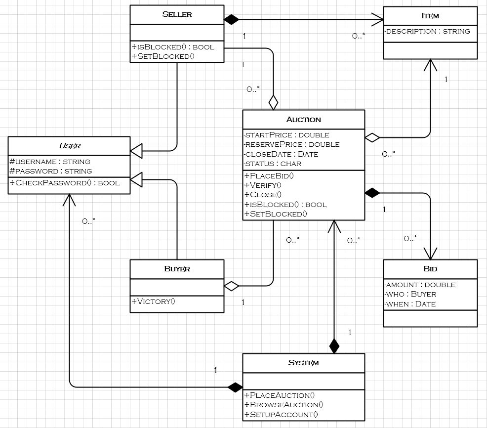
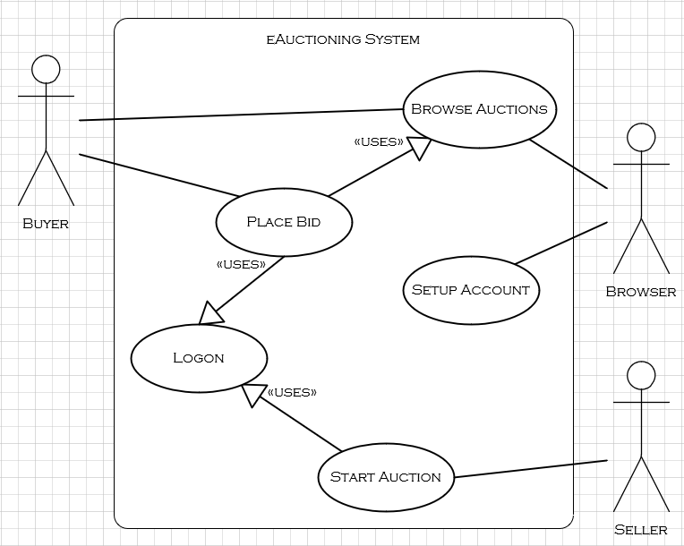

# 5104COMP OO: eAuction System
University Group Project to develop a working eAuction console application prototype, using the OOAD solution model.

## Organisation:
***Class Diagram:***

***Use Case Diagram:***

## Requirements:

## Features:
[x] Establish working directory and Class structure.
[ ] 
[ ]
[ ]
